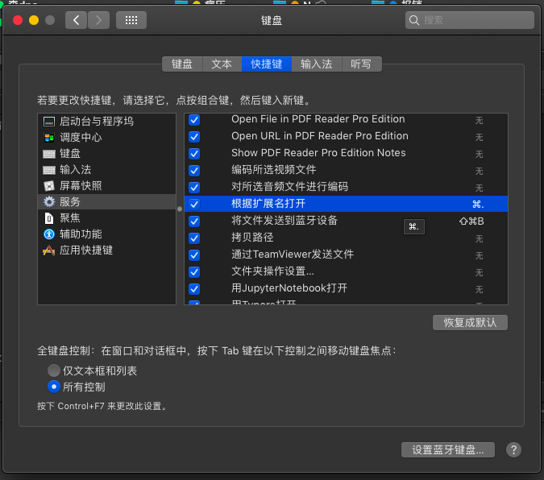
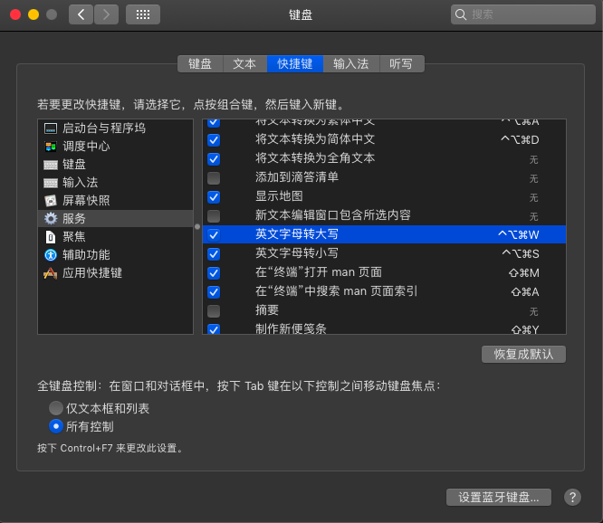
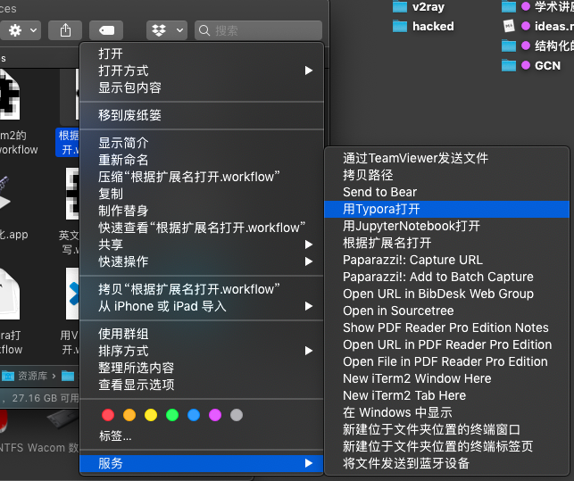
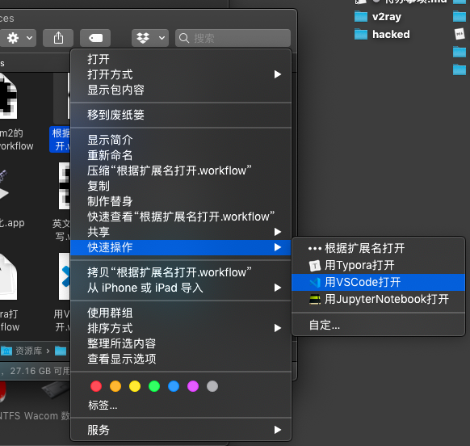

# Mac Services 教程

安装教程

```bash
git clone https://github.com/hyliang96/mac-services mac-services
mv mac-services/* ~/Library/Services/
```

然后就会在 `系统偏好设置/键盘/快捷键/服务` 里看见这些服务,









此外, 在`系统偏好设置/扩展/访达`, 


