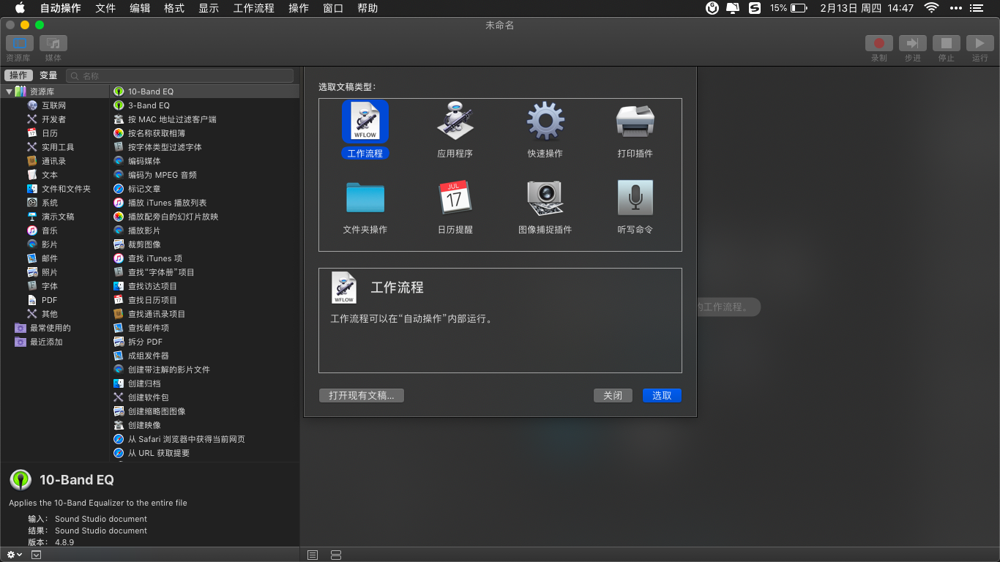
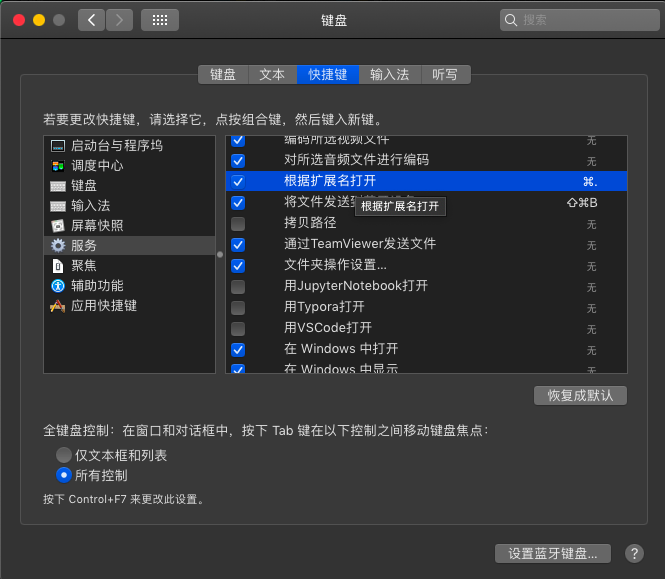
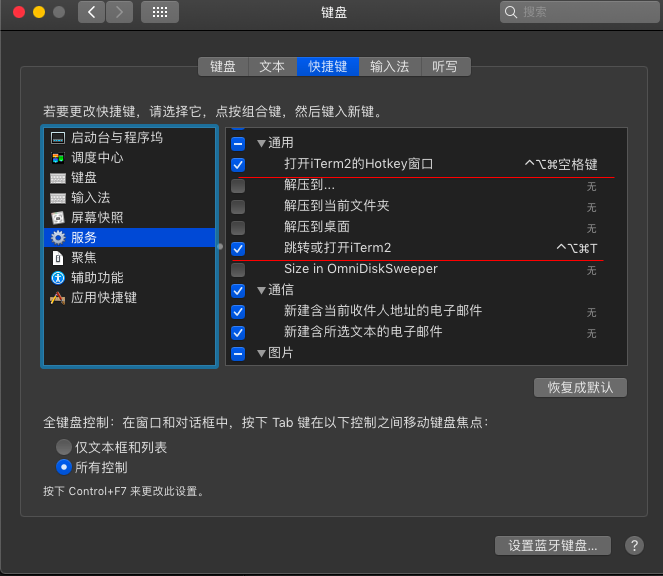
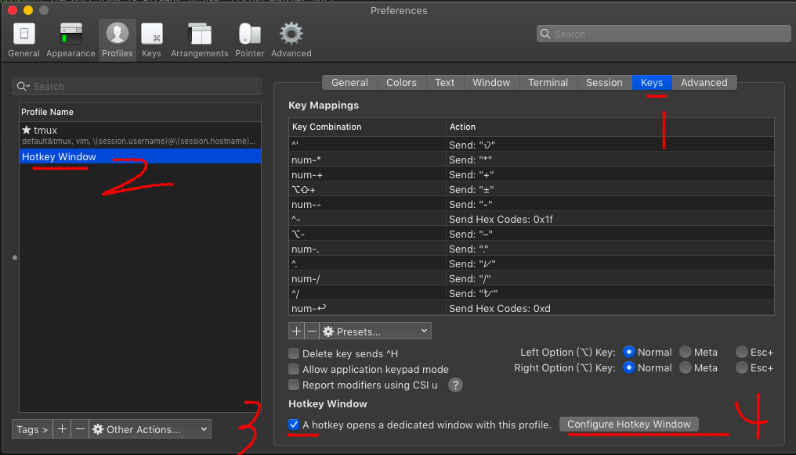
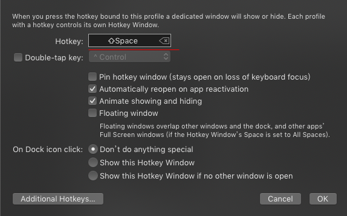
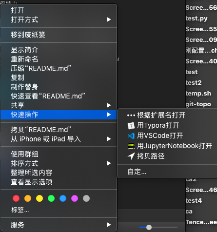
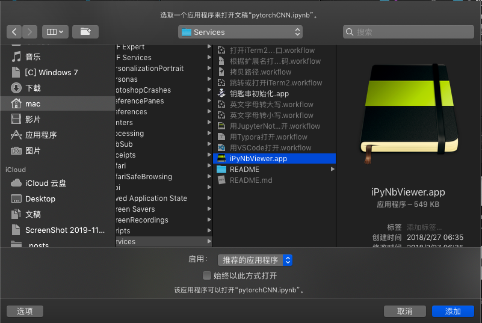
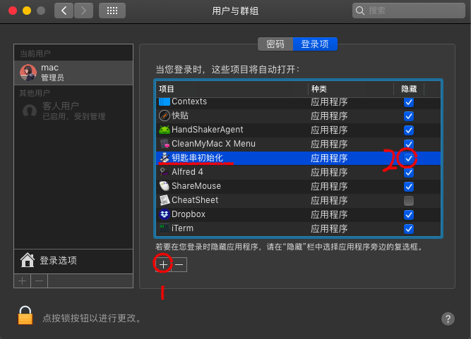

# Mac Services 教程

使用mac自带的`自动操作.app`可以编写大量 macOS 中使用的自带操作小程序. 它能编写的程序类型有多种.本repo中文件均为的 `工作流程`, `快速操作`, `应用程序`.

本repo中的 `.workflow` 文件均为 `工作流程` 或 `快速操作`, `.app`文件为 `应用程序`.




安装教程

```bash
git clone https://github.com/hyliang96/mac-services mac-services
mv mac-services/* ~/Library/Services/
```


## `服务`的设置

`服务` 可以是用`自动操作.app` 编写的 `.workflow`程序 (它可以是`工作流程` 或 `快速操作`), 也可以是其他软件为操作系统提供的触发小程序.

`访问` 位于访达中, `鼠标右键-菜单-服务`.


**设置方法**

在 `系统偏好设置/键盘/快捷键/服务` 里找到本repo中  `.workflow`程序 同名的条目, 勾选或勾除之, 可绑定快捷键.

### 根据扩展名打开代码

*    `系统偏好设置/键盘/快捷键/服务/文件和文件夹` 下的  `根据扩展名打开代码` 条目,

    *  将其勾选, 则在访达中选中文件或文件夹, 然后`鼠标右键/服务`里会看见此条目. 
    
    *  再设置快捷键为 `⌘.`, 则可以在访达中选中文件或文件夹后, 用快捷键触发此服务.

    

    *   打开`./根据扩展名打开代码.workflow`, 将 `post_root="/Users/${USER}/Desktop/myblog/source/_posts”` 改为你的hexo源码目录下的`source/_post/`文件夹的路径.

    *   此服务的用法: 

        在访达选中 `xxx.md/` 文件, 触发此服务, 则会用 `Typora.App` 打开  `xxxx.md/main.md` 文件. 用`./iPyNbViewer.app`(见下[用jupyter notebook快速打开](#用jupyter notebook快速打开)) 打开`.ipynb` 文件. 其余文件或文件夹用vscode打开.
    
        与之配套的.md文件和附件管理方式
        
        ```
        xxx.md/    把markdown文件和附件包在一个文件夹下, 以.md结尾告诉 `根据扩展名打开`服务 用Typora.app 开main.md
          main.md  .md文件
          main/     附件文件夹, 之所以用main命名, 是为了和main.md同名, 便于让hexo编译时, 需二者同名, 才能用上这些附件去编译
        xxx.jpg   .md文件中用到的插图
        xxx.png
    xxx.gif
        ```
    
        ``Typora.App`设置为, 把图片附件拷贝到与当前.md文件同名、同目录的文件夹里. 
        
        

### iTerm2打开的快捷键

在`通用`中勾选并绑定快捷键如下.



*   打开 `./打开iTerm2的Hotkey窗口.workflow` 文件, 找到`使用iTerm2的快捷键`, 将`{shift down}`改为你的 iTerm2.app 中 开启 HotKey 窗口 的快捷键.

```
# 使用iTerm2的快捷键 shift+space来开 hotkey window
keystroke space using {shift down}
```

 iTerm2.app 中 开启 HotKey 窗口 的快捷键设置方法如下:





### 大小写转换

*   `系统偏好设置/键盘/快捷键/服务/文本` 下的  `英文字母转大写` `英文字母转小写` 条目, 分布勾选, 如下设置快捷键. 

    用法: 则在任何软件中, 光标选中一段文本, 按此快捷键, 会将从文本转换大小写.


## `快速操作`的设置

### 拷贝路径/使用某软件打开

快捷操作也是 `.workflow`文件. 快速操作位于 在访达中, `鼠标右键-菜单-快捷操作`. 

由于`服务`里有大量其他软件添加的服务, 列表太长不便于选中, 故推荐将个人自定义的服务放在`快捷操作`的list里.



**设置的方法**

在  `系统偏好设置/键盘/快捷键/服务`  里勾除此服务, 以使得`服务`列表里没有此项. 但如果你需要给这个服务设置快捷键, 则不要勾除此服务. 

例如下图中:

*    `根据扩展名打开` 要设置快捷键 `⌘.`, 故勾选它. 
*   而其他的服务( 如 `拷贝路径`, `用JupyterNotebook打开`, `用Typora打开`, `用VSCode打开` ), 不设置快捷键, 均勾除. 


在`系统偏好设置/扩展/访达` 里勾选需要放入`快捷操作`列表的服务.


## 用jupyter notebook快速打开

这是 在访达中用jupyter notebook快速打开文件(夹)的软件

### 用法

在finder中选中文件或文件夹，

*   .ipynb文件：双击之，或 选中之-右键-快捷操作-用JupyterNotebook打开
*   文件夹：选中之-右键-快捷操作-用JupyterNotebook打开

则会用iTerm2.app开新标签页，启动jupyter notebook开此文件（夹），并自启启动默认浏览器开新标签页查看之

### 安装

*   `./iPyNbViewer.app`: [下载链接](https://bioequity.org/ipynbviewer/)

*   `用JupyterNotebook打开.workflow`: 自己写的，拷贝到`~/Library/Services`

*   系统偏好设置-键盘-快捷键-服务-文件和文件夹-**勾除**“`用JupyterNotebook打开”:་以便在访达-右键-服务 中看不到这个条

*   系统偏好设置-扩展-访达-勾选‘用JupyterNotebook打开‘：以便在访达-右键-快捷操作 中看见这条

*   找到一个 `.pynb` 文件, `右键-显示简介`, 弹出简介框, 选`打开方式`, 

    

    ​	选取`./iPyNbViewer.app`, 作为`.ipynb` 的默认打开方式. 这样双击`.ipynb`文件就会用此软件打开.

    

## 开机将ssh私钥加入钥匙串

若 `~/.ssh/` 下诸钥私未加入到 mac系统的KeyChain, 在终端下用ssh等命令时, 若未手动指定私钥, 则不会使用私钥. 这样很不方便.

若将这些私钥加入KeyChain, 用ssh等命令时, 若未手动指定私钥, 也会一个个私钥去试, 只要有一个私钥能开, 就用私钥完成ssh登录.

将私钥加入KeyChain的命令是 `ssh-add  <私钥>`. 但是在此开机, KeyChain清空了这些私钥, 又要手动把私钥加入KeyChain. 

`./钥匙串初始化.app` 就是用来 开机自动把私钥加入KeyChain. 

用`自动操作.app`打开`./钥匙串初始化.app` , 内容如下, 可以自行编辑把哪些私钥加入KeyChain.

```
# 将私钥添加到苹果系统的KeyChain
ssh-add ~/.ssh/*id_rsa
ssh-add ~/.ssh/*/*id_rsa
```

为了让`./钥匙串初始化.app` 开机自启, 需要在 `系统偏好设置-用户与群组-当前用户-登录项` , 点`+`, 然后添加`./钥匙串初始化.app`, 并勾选`隐藏` (表示开机时再后台运行此程序 而不现实其窗口).

